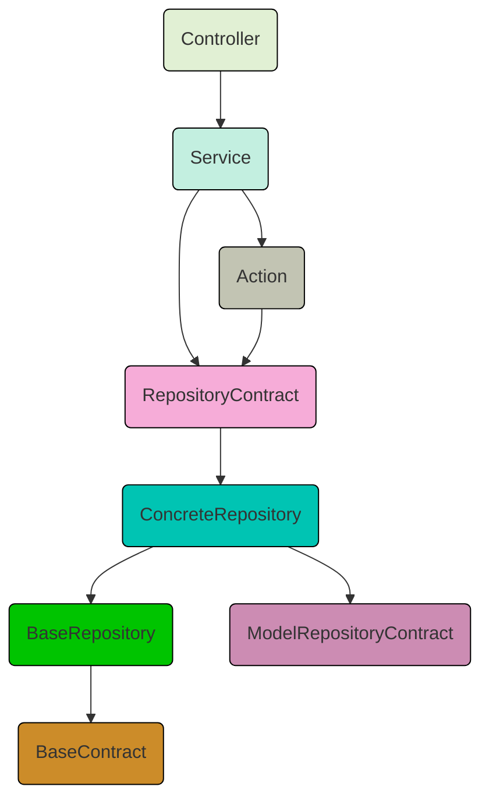

# Funzionalità implementate
- Dashboard con chart reattive tramite Livewire
- Sezione crud User
- Sezione crud Role e Permission
- Sezioni crud per i 3 model gestiti (Customer, Product e Order)
- Le sezioni Prodotti e Ordine nel loro index presentano la ricerca 
- Versioning delle api
- Protezione rotte tramite sanctum
- Gestione delle FormRequest con l'auth basata sul permesso assegnato al ruolo
- Gestione della paginazione api tramite middleware SetPagination
- Utilizzo delle ApiResoource di laravel per favorire la consistenza dei dati
- Le API supportano il caricamento dinamico delle relazioni tramite il parametro `include` nella query string. Solo le relazioni dichiarate nel modello come includibili vengono caricate.
- Documentazione testabile API raggiungibile alla rotta `/api/documentation`
- Consultazione Log di sistema al path log-viewer alla rotta `/log-viewer`

## Design Patterns
- Repository:
    - Incapsula le query al database  
    - Permette di sostituire facilmente il livello di persistenza  
    - Favorisce l’uso di interfacce per testare con mock 
- Service:
    - Centralizza la logica di business
- Action:
    - Semplifica l’aggiunta di nuove operazioni
    - Favorisce l’uso di classi singole per compiti specifici
    - Rende il codice più leggibile
- Event ( Listeners ):
    - Decoupla l’azione principale dagli effetti collaterali
    - Consente l’uso di operazioni asincrone
    - Facilita l’aggiunta di nuove logiche senza modificare il codice esistente
- Observer: 
    - il trait `LogsActivity` ascolta gli eventi sui model registrando i log



# Scelte Architetturali
Oltre i 3 model descritti nel test (Customer, Product e Order), ho definito un model `OrderProduct` che è la tabella pivot della relazione N-N fra i 2 model che compongono il nome stesso. Questo per poter gestire il dato storico del prodotto al momento dell'ordine. L'approccio della mera associazione degli id dei 2 model, falserebbe il dato in casso di modifica del rpezzo di un prodotto che è stato già inserito in qualche ordine pregresso.

Creato il model `OrderHistoryStep` per creare uno storico dei passaggi di stato dell'ordine

Inseriti dispatch di eventi per integrare eventuali azioni da effettuare al verificarsi di determinate condizioni. Vedi l'evento OrderStatusChanged dentro CreateOrderAction.

Gestita cache per l'api più corposa agento nella `BaseRepository` e gestendo le chiavi paginate


# Dipendenze del Progetto
Questo documento elenca le dipendenze utilizzate nel progetto oltre al framework Laravel.

## Dipendenze di Produzione

| Pacchetto | Descrizione |
|-----------|------------|
| `asantibanez/livewire-charts` | Libreria per la creazione di grafici con Livewire. |
| `laravel/ui` | Pacchetto UI per Laravel (Bootstrap, Vue, React). |
| `livewire/livewire` | Framework per componenti reattivi in Laravel. |
| `livewire/volt` | Estensione per Livewire che semplifica la gestione delle componenti. |
| `opcodesio/log-viewer` | Visualizzatore di log per Laravel. |
| `realrashid/sweet-alert` | Integrazione di SweetAlert2 in Laravel. |
| `spatie/laravel-activitylog` | Gestione dei log di attività in Laravel. |

| `spatie/laravel-medialibrary` | Gestione avanzata dei file multimediali. |
| `spatie/laravel-permission` | Gestione dei ruoli e permessi. |

## Dipendenze di Sviluppo

| Pacchetto | Descrizione |
|-----------|------------|
| `barryvdh/laravel-debugbar` | Debugbar per Laravel. |
| `barryvdh/laravel-ide-helper` | Aiuto per IDE con suggerimenti sulle classi. |
| `laravel/pint` | Strumento di formattazione del codice PHP per Laravel. |
| `laravel/sail` | Ambiente di sviluppo Docker per Laravel. |
| `laraveldaily/larastarters` | Starter kit per Laravel. |
| `pestphp/pest` | Framework di testing moderno per PHP. |
| `pestphp/pest-plugin-laravel` | Plugin per Pest dedicato a Laravel. |


## Installazione
Per lo sviluppo è stato utilizzato `sail` per gestire il docker-compose agevolmente.\
Di seguito i servizi buildati:
- orders: php
- mailpit: interfacia web per le mail
- mysql

Segui questi passaggi per installare il progetto:
1. Clona il repository: `git clone https://github.com/Cjleto/orders`
2. Installa le dipendenze: `composer update` *(vedi i dettagli dell'avviso sotto)*
3. Copia il file `.env.example` in un nuovo file chiamato `.env` e modifica le variabili d'ambiente secondo necessità(Port Forward)
4. Avvia il container usando sail: `./vendor/bin/sail up`
5. Crea un collegamento simbolico per lo storage `sail artisan storage:link`
6. Esegui le migrazioni del database e i seeder iniziali: `./vendor/bin/sail artisan migrate:fresh --seed`
  
> :warning: Se non hai la versione corretta di php sul tuo host, esegui questo comando nella directory principale del progetto:
```
docker run --rm \
	-u "$(id -u):$(id -g)" \
	-v "$(pwd):/var/www/html" \
	-w /var/www/html \
	laravelsail/php83-composer:latest \
	composer install --ignore-platform-reqs
```

## Dati iniziali

Cosa inseriscono i seeder:
- Modelli di Ruolo e Permesso
- Utente admin con email `admin@admin.com` e password `Qwerty7-`
- 10 Clienti tramite Factory
- 10 Prodotti tramite Factory
- 10 Ordini tramite Factory

## Tool
- Esegui i test `./vendor/bin/sail artisan test` (`--parallel` processo più veloce)
- Verifica lo stile del codice: `./vendor/bin/sail php ./vendor/bin/pint --test`
- Genera la documentazione API usando il comando: `./vendor/bin/sail artisan l5-swagger:generate`

## Da fare
- Accedi alla documentazione API generata su `http://localhost:${APP_PORT}/docs`
- Esegui l'analisi del codice statico: `./vendor/bin/sail php ./vendor/bin/phpstan analyse --memory-limit=2G`
- Estendere l'utilizzo dei metodi in cache
- Aggiungere altri unit e feature test
- Integrare workflow github per runnare i test in fase di pr
- Ottimizzazione query ove possibile

